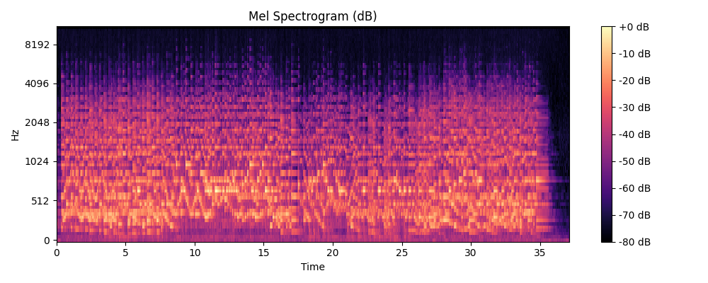

# Audio DSP Basics

Foundation project for audio and speech machine learning.

## Example Output

### Waveform

### Mel Spectrogram

The waveform shows the raw audio signal in the time domain.

The mel spectrogram shows the time–frequency representation used by
speech and audio generation models.

